# PowerEdge v2.0 - Guia do Desenvolvedor

Este guia é voltado para desenvolvedores que desejam contribuir, modificar ou integrar com o sistema PowerEdge.

## 📋 Índice

- [Arquitetura do Sistema](#-arquitetura-do-sistema)
- [Ambiente de Desenvolvimento](#-ambiente-de-desenvolvimento)
- [Estrutura do Código](#-estrutura-do-código)
- [API REST Detalhada](#-api-rest-detalhada)
- [WebSocket Protocol](#-websocket-protocol)
- [Banco de Dados](#-banco-de-dados)
- [Frontend/JavaScript](#-frontendjavascript)
- [Testes e Debug](#-testes-e-debug)
- [Contribuindo](#-contribuindo)

---

## 🏗️ Arquitetura do Sistema

### Visão Geral
```
┌─────────────────┐    ┌─────────────────┐    ┌─────────────────┐
│   Hardware      │    │   Backend       │    │   Frontend      │
│                 │    │                 │    │                 │
│ ADS1115 + RPi   │◄──►│ Flask + WS      │◄──►│ HTML + JS       │
│ Sensors         │    │ SQLite          │    │ Modern UI       │
│ I2C Bus         │    │ Python 3.7+     │    │ WebSocket       │
└─────────────────┘    └─────────────────┘    └─────────────────┘
```

### Componentes Principais

#### 1. **Hardware Layer** (Opcional - Modo Simulação Disponível)
- **ADS1115**: ADC 16-bit I2C para leitura de tensão
- **Sensores**: Divisores de tensão para cada fonte
- **Raspberry Pi**: Controlador principal com GPIO/I2C

#### 2. **Backend Layer**
- **Flask**: API REST para consultas e comandos
- **WebSocket**: Streaming de dados em tempo real
- **SQLite**: Persistência de eventos e configurações
- **Logging**: Sistema estruturado de logs

#### 3. **Frontend Layer**
- **HTML5**: Interface moderna e responsiva
- **JavaScript ES6+**: Cliente WebSocket e interações
- **CSS3**: Design system profissional
- **PWA Ready**: Preparado para Progressive Web App

### Fluxo de Dados

```mermaid
graph TD
    A[Sensores] --> B[ADS1115]
    B --> C[I2C Bus]
    C --> D[Python Backend]
    D --> E[SQLite DB]
    D --> F[WebSocket]
    D --> G[REST API]
    F --> H[Frontend JS]
    G --> H
    H --> I[User Interface]
    J[Simulação] -.-> D
```



---

## 💻 Ambiente de Desenvolvimento

### Configuração Local

#### 1. Pré-requisitos
```bash
# Python 3.7+ (verificar versão)
python --version

# Git (para controle de versão)
git --version

# Editor de código recomendado: VS Code
```

#### 2. Setup do Projeto
```bash
# Clone do repositório
git clone https://github.com/seu-usuario/PowerEdge.git
cd PowerEdge

# Criar ambiente virtual
python -m venv venv

# Ativar ambiente virtual
# Linux/Mac:
source venv/bin/activate

# Windows:
venv\Scripts\activate

# Instalar dependências
pip install -r requirements.txt

# Instalar dependências de desenvolvimento (opcional)
pip install -r requirements-dev.txt
```

#### 3. Estrutura de Desenvolvimento
```
PowerEdge/
├── app/                    # Backend Python
│   ├── __init__.py        # Módulo Python
│   ├── run.py             # Aplicação principal
│   ├── config.py          # Configurações
│   ├── models/            # Modelos de dados
│   ├── api/               # Endpoints REST
│   └── websocket/         # Handlers WebSocket
├── static/                # Frontend
│   ├── index.html         # Interface principal
│   ├── js/                # JavaScript modulado
│   ├── css/               # Estilos
│   └── assets/            # Imagens/ícones
├── tests/                 # Testes automatizados
│   ├── test_api.py        # Testes da API
│   ├── test_websocket.py  # Testes WebSocket
│   └── test_simulation.py # Testes simulação
├── docs/                  # Documentação
├── scripts/               # Scripts utilitários
└── requirements-dev.txt   # Deps desenvolvimento
```

### Dependências de Desenvolvimento

#### requirements-dev.txt
```txt
# Testes
pytest==7.4.0
pytest-asyncio==0.21.0
pytest-cov==4.1.0

# Linting e formatação
black==23.7.0
flake8==6.0.0
isort==5.12.0
mypy==1.5.0

# Desenvolvimento
flask-testing==0.8.1
websocket-client==1.6.1
requests==2.31.0

# Documentação
sphinx==7.1.0
sphinx-rtd-theme==1.3.0
```

#### Setup do ambiente de desenvolvimento
```bash
# Instalar hooks de pre-commit
pip install pre-commit
pre-commit install

# Configurar formatação automática
black --line-length 88 app/
isort app/
flake8 app/
```

---

## 📁 Estrutura do Código

### Backend (Python)

#### app/run.py - Aplicação Principal
```python
"""
Aplicação principal do PowerEdge
- Inicialização do Flask
- Setup WebSocket
- Detecção de hardware
- Loop principal de monitoramento
"""

import asyncio
import threading
from flask import Flask
from websockets import serve

class PowerEdgeApp:
    def __init__(self):
        self.app = Flask(__name__)
        self.hardware_available = self.detect_hardware()
        self.setup_routes()
        self.setup_websocket()
    
    def detect_hardware(self):
        """Detecta se hardware está disponível"""
        try:
            import board, busio, adafruit_ads1x15
            return True
        except ImportError:
            return False
    
    def setup_routes(self):
        """Configura rotas da API REST"""
        from .api.routes import api_bp
        self.app.register_blueprint(api_bp)
    
    def setup_websocket(self):
        """Configura servidor WebSocket"""
        from .websocket.handlers import websocket_handler
        self.ws_server = serve(websocket_handler, "0.0.0.0", 8765)
```

#### app/config.py - Configurações
```python
"""
Configurações centralizadas do sistema
- Variáveis de ambiente
- Configurações de hardware
- Constantes do sistema
"""

import os
from dataclasses import dataclass
from typing import Dict, Any

@dataclass
class SourceConfig:
    """Configuração de uma fonte de energia"""
    canal: int
    nome: str
    cor: str
    icone: str
    prioridade: int
    fator_conversao: float = 1.0
    limiar_personalizado: float = None

# Configurações das fontes
FONTES_CONFIG = {
    "rede": SourceConfig(
        canal=0,
        nome="Rede Elétrica",
        cor="#4ecdc4",
        icone="🏠",
        prioridade=1,
        fator_conversao=67.0,  # Para divisor 67:1
        limiar_personalizado=200.0
    ),
    # ... outras fontes
}

class Config:
    """Configurações principais"""
    # Banco de dados
    DATABASE_PATH = os.getenv('DATABASE_PATH', 'energia.db')
    
    # Rede
    FLASK_HOST = os.getenv('FLASK_HOST', '0.0.0.0')
    FLASK_PORT = int(os.getenv('FLASK_PORT', 5000))
    WEBSOCKET_HOST = os.getenv('WEBSOCKET_HOST', '0.0.0.0')
    WEBSOCKET_PORT = int(os.getenv('WEBSOCKET_PORT', 8765))
    
    # Monitoramento
    LIMIAR_TENSAO = float(os.getenv('LIMIAR_TENSAO', 0.8))
    INTERVALO_LEITURA = float(os.getenv('INTERVALO_LEITURA', 1.0))
    
    # Logging
    LOG_LEVEL = os.getenv('LOG_LEVEL', 'INFO')
    LOG_FILE = os.getenv('LOG_FILE', 'logs/energia.log')
```

#### app/models/ - Modelos de Dados
```python
# app/models/evento.py
"""
Modelo para eventos de energia
"""

from dataclasses import dataclass
from datetime import datetime
from typing import Optional

@dataclass
class Evento:
    """Representa um evento de energia"""
    id: Optional[int]
    fonte: str
    tipo: str
    tensao: Optional[float]
    data_hora: datetime
    
    def to_dict(self) -> dict:
        """Converte para dicionário"""
        return {
            'id': self.id,
            'fonte': self.fonte,
            'tipo': self.tipo,
            'tensao': self.tensao,
            'data_hora': self.data_hora.isoformat()
        }
    
    @classmethod
    def from_db_row(cls, row) -> 'Evento':
        """Cria instância a partir de linha do banco"""
        return cls(
            id=row['id'],
            fonte=row['fonte'],
            tipo=row['tipo'],
            tensao=row['tensao'],
            data_hora=datetime.fromisoformat(row['data_hora'])
        )

# app/models/fonte.py
"""
Modelo para fonte de energia
"""

@dataclass
class FonteStatus:
    """Status atual de uma fonte"""
    nome: str
    tensao: float
    estado: str  # ATIVA, FALHA, ERRO
    timestamp: datetime
    config: dict
    
    def to_dict(self) -> dict:
        return {
            'tensao': round(self.tensao, 2),
            'estado': self.estado,
            'timestamp': self.timestamp.isoformat(),
            'config': self.config
        }
```

### Frontend (JavaScript)

#### static/js/app.js - Aplicação Principal
```javascript
/**
 * PowerEdge Frontend Application
 * Arquitetura modular ES6+
 */

class PowerEdgeApp {
    constructor() {
        this.config = {
            apiUrl: `http://${window.location.hostname}:5000`,
            wsUrl: `ws://${window.location.hostname}:8765`,
            updateInterval: 1000,
            reconnectInterval: 5000
        };
        
        this.state = {
            connected: false,
            sources: {},
            events: [],
            currentSection: 'dashboard'
        };
        
        this.components = {
            dashboard: new DashboardComponent(this),
            sources: new SourcesComponent(this),
            events: new EventsComponent(this),
            stats: new StatsComponent(this)
        };
        
        this.init();
    }
    
    async init() {
        this.setupEventListeners();
        this.connectWebSocket();
        await this.loadInitialData();
        this.startPeriodicUpdates();
    }
    
    // ... métodos da aplicação
}

// Componentes modulares
class DashboardComponent {
    constructor(app) {
        this.app = app;
        this.element = document.getElementById('dashboard-section');
    }
    
    render(data) {
        // Renderizar dashboard
    }
    
    update(sources) {
        // Atualizar dados em tempo real
    }
}

class SourcesComponent {
    constructor(app) {
        this.app = app;
        this.element = document.getElementById('sources-section');
    }
    
    render(sources) {
        // Renderizar cards das fontes
    }
}
```

#### static/js/websocket.js - Cliente WebSocket
```javascript
/**
 * Cliente WebSocket para dados em tempo real
 */

class WebSocketClient {
    constructor(url, options = {}) {
        this.url = url;
        this.options = {
            reconnectInterval: 5000,
            maxReconnectAttempts: 10,
            ...options
        };
        
        this.ws = null;
        this.reconnectAttempts = 0;
        this.listeners = new Map();
    }
    
    connect() {
        try {
            this.ws = new WebSocket(this.url);
            this.setupEventHandlers();
        } catch (error) {
            this.handleError(error);
        }
    }
    
    setupEventHandlers() {
        this.ws.onopen = () => {
            console.log('WebSocket conectado');
            this.reconnectAttempts = 0;
            this.emit('connected');
        };
        
        this.ws.onmessage = (event) => {
            try {
                const data = JSON.parse(event.data);
                this.emit('data', data);
            } catch (error) {
                console.error('Erro ao processar dados:', error);
            }
        };
        
        this.ws.onclose = () => {
            console.log('WebSocket desconectado');
            this.emit('disconnected');
            this.scheduleReconnect();
        };
        
        this.ws.onerror = (error) => {
            console.error('Erro WebSocket:', error);
            this.emit('error', error);
        };
    }
    
    on(event, callback) {
        if (!this.listeners.has(event)) {
            this.listeners.set(event, []);
        }
        this.listeners.get(event).push(callback);
    }
    
    emit(event, data = null) {
        const callbacks = this.listeners.get(event) || [];
        callbacks.forEach(callback => callback(data));
    }
    
    scheduleReconnect() {
        if (this.reconnectAttempts < this.options.maxReconnectAttempts) {
            this.reconnectAttempts++;
            setTimeout(() => {
                console.log(`Tentativa de reconexão ${this.reconnectAttempts}`);
                this.connect();
            }, this.options.reconnectInterval);
        }
    }
}
```

---

## 🌐 API REST Detalhada

### Endpoints Disponíveis

#### GET /status
**Descrição**: Retorna status atual de todas as fontes

**Response**:
```json
{
  "status": "ok",
  "hardware_disponivel": true,
  "timestamp": "2025-07-02T10:30:00.123Z",
  "fontes": {
    "rede": {
      "tensao": 220.5,
      "estado": "ATIVA",
      "timestamp": "2025-07-02T10:30:00.123Z",
      "config": {
        "canal": 0,
        "nome": "Rede Elétrica",
        "cor": "#4ecdc4",
        "icone": "🏠",
        "prioridade": 1
      }
    }
  }
}
```

#### GET /eventos
**Descrição**: Lista eventos com filtros opcionais

**Parâmetros**:
- `limite` (int): Número máximo de eventos (padrão: 100)
- `fonte` (string): Filtrar por fonte específica
- `tipo` (string): Filtrar por tipo de evento
- `data_inicio` (ISO date): Data inicial do filtro
- `data_fim` (ISO date): Data final do filtro

**Exemplo**:
```bash
GET /eventos?limite=50&fonte=rede&tipo=FALHA
```

**Response**:
```json
[
  {
    "id": 123,
    "fonte": "rede",
    "tipo": "FALHA",
    "tensao": 180.5,
    "data_hora": "2025-07-02T10:25:00.000Z"
  }
]
```

#### POST /eventos
**Descrição**: Cria evento manual

**Payload**:
```json
{
  "fonte": "rede",
  "tipo": "MANUTENCAO",
  "tensao": 220.0,
  "observacoes": "Manutenção programada"
}
```

**Response**:
```json
{
  "status": "ok",
  "mensagem": "Evento criado com sucesso",
  "id": 124
}
```

#### GET /config
**Descrição**: Retorna configurações atuais

**Response**:
```json
{
  "limiar_tensao": 0.8,
  "intervalo_leitura": 1.0,
  "fontes": {
    "rede": {
      "canal": 0,
      "nome": "Rede Elétrica",
      "fator_conversao": 67.0,
      "limiar_personalizado": 200.0
    }
  }
}
```

#### PUT /config
**Descrição**: Atualiza configurações

**Payload**:
```json
{
  "limiar_tensao": 1.0,
  "intervalo_leitura": 2.0
}
```

### Implementação dos Endpoints

#### app/api/routes.py
```python
"""
Rotas da API REST
"""

from flask import Blueprint, jsonify, request
from ..models.evento import Evento
from ..services.monitor import MonitorService
from ..services.config import ConfigService

api_bp = Blueprint('api', __name__, url_prefix='/api')

@api_bp.route('/status', methods=['GET'])
def get_status():
    """Retorna status atual do sistema"""
    try:
        monitor = MonitorService()
        status_data = monitor.get_current_status()
        
        return jsonify({
            'status': 'ok',
            'hardware_disponivel': monitor.hardware_available,
            'timestamp': datetime.now().isoformat(),
            'fontes': status_data
        })
    except Exception as e:
        return jsonify({'error': str(e)}), 500

@api_bp.route('/eventos', methods=['GET'])
def get_eventos():
    """Lista eventos com filtros"""
    try:
        # Parâmetros de query
        limite = request.args.get('limite', 100, type=int)
        fonte = request.args.get('fonte')
        tipo = request.args.get('tipo')
        data_inicio = request.args.get('data_inicio')
        data_fim = request.args.get('data_fim')
        
        # Buscar eventos
        eventos = EventoService.buscar_eventos(
            limite=limite,
            fonte=fonte,
            tipo=tipo,
            data_inicio=data_inicio,
            data_fim=data_fim
        )
        
        return jsonify([evento.to_dict() for evento in eventos])
        
    except Exception as e:
        return jsonify({'error': str(e)}), 500

@api_bp.route('/eventos', methods=['POST'])
def create_evento():
    """Cria novo evento"""
    try:
        data = request.get_json()
        
        # Validação
        if not data or 'fonte' not in data:
            return jsonify({'error': 'Campo fonte é obrigatório'}), 400
        
        # Criar evento
        evento = Evento(
            id=None,
            fonte=data['fonte'],
            tipo=data.get('tipo', 'MANUAL'),
            tensao=data.get('tensao'),
            data_hora=datetime.now()
        )
        
        evento_id = EventoService.criar_evento(evento)
        
        return jsonify({
            'status': 'ok',
            'mensagem': 'Evento criado com sucesso',
            'id': evento_id
        })
        
    except Exception as e:
        return jsonify({'error': str(e)}), 500
```

---

## 🔌 WebSocket Protocol

### Mensagens do Servidor

#### Dados de Status (1s interval)
```json
{
  "type": "status_update",
  "timestamp": "2025-07-02T10:30:00.123Z",
  "data": {
    "rede": {
      "tensao": 220.5,
      "estado": "ATIVA",
      "timestamp": "2025-07-02T10:30:00.123Z"
    },
    "solar": {
      "tensao": 24.2,
      "estado": "ATIVA", 
      "timestamp": "2025-07-02T10:30:00.123Z"
    }
  }
}
```

#### Eventos em Tempo Real
```json
{
  "type": "event",
  "timestamp": "2025-07-02T10:30:00.123Z",
  "data": {
    "fonte": "rede",
    "tipo": "FALHA",
    "tensao": 180.5,
    "estado_anterior": "ATIVA",
    "estado_atual": "FALHA"
  }
}
```

#### Alertas do Sistema
```json
{
  "type": "alert",
  "timestamp": "2025-07-02T10:30:00.123Z",
  "data": {
    "level": "warning",
    "message": "Tensão da rede abaixo do normal",
    "source": "rede",
    "value": 195.5
  }
}
```

### Mensagens do Cliente

#### Ping/Pong (Heartbeat)
```json
{
  "type": "ping",
  "timestamp": "2025-07-02T10:30:00.123Z"
}
```

#### Comando de Configuração
```json
{
  "type": "config_update",
  "data": {
    "limiar_tensao": 1.0,
    "intervalo_leitura": 2.0
  }
}
```

### Implementação WebSocket

#### app/websocket/handlers.py
```python
"""
Handlers WebSocket
"""

import asyncio
import json
import websockets
from datetime import datetime
from ..services.monitor import MonitorService

connected_clients = set()

async def websocket_handler(websocket, path):
    """Handler principal WebSocket"""
    connected_clients.add(websocket)
    
    try:
        # Enviar status inicial
        await send_initial_status(websocket)
        
        # Loop de escuta
        async for message in websocket:
            await handle_client_message(websocket, message)
            
    except websockets.exceptions.ConnectionClosed:
        pass
    except Exception as e:
        print(f"Erro WebSocket: {e}")
    finally:
        connected_clients.discard(websocket)

async def send_initial_status(websocket):
    """Envia status inicial para cliente conectado"""
    monitor = MonitorService()
    status_data = monitor.get_current_status()
    
    message = {
        'type': 'status_update',
        'timestamp': datetime.now().isoformat(),
        'data': status_data
    }
    
    await websocket.send(json.dumps(message))

async def handle_client_message(websocket, message):
    """Processa mensagem do cliente"""
    try:
        data = json.loads(message)
        message_type = data.get('type')
        
        if message_type == 'ping':
            await websocket.send(json.dumps({
                'type': 'pong',
                'timestamp': datetime.now().isoformat()
            }))
            
        elif message_type == 'config_update':
            # Processar atualização de configuração
            await handle_config_update(data['data'])
            
    except json.JSONDecodeError:
        await websocket.send(json.dumps({
            'type': 'error',
            'message': 'Formato JSON inválido'
        }))

async def broadcast_to_clients(message):
    """Envia mensagem para todos os clientes conectados"""
    if connected_clients:
        await asyncio.gather(
            *[client.send(json.dumps(message)) for client in connected_clients],
            return_exceptions=True
        )

# Loop principal de monitoramento
async def monitoring_loop():
    """Loop principal que envia dados periodicamente"""
    monitor = MonitorService()
    
    while True:
        try:
            # Obter dados atuais
            status_data = monitor.get_current_status()
            
            # Criar mensagem
            message = {
                'type': 'status_update',
                'timestamp': datetime.now().isoformat(),
                'data': status_data
            }
            
            # Enviar para todos os clientes
            await broadcast_to_clients(message)
            
            # Aguardar intervalo configurado
            await asyncio.sleep(monitor.config.INTERVALO_LEITURA)
            
        except Exception as e:
            print(f"Erro no loop de monitoramento: {e}")
            await asyncio.sleep(5)  # Aguardar antes de tentar novamente
```

---

## 🗄️ Banco de Dados

### Schema SQLite

#### Tabela: eventos
```sql
CREATE TABLE eventos (
    id INTEGER PRIMARY KEY AUTOINCREMENT,
    fonte TEXT NOT NULL,
    tipo TEXT NOT NULL,
    tensao REAL,
    data_hora TEXT NOT NULL,
    observacoes TEXT,
    created_at TIMESTAMP DEFAULT CURRENT_TIMESTAMP,
    UNIQUE(fonte, tipo, data_hora)
);

CREATE INDEX idx_eventos_data_hora ON eventos(data_hora DESC);
CREATE INDEX idx_eventos_fonte ON eventos(fonte);
CREATE INDEX idx_eventos_tipo ON eventos(tipo);
```

#### Tabela: configuracoes
```sql
CREATE TABLE configuracoes (
    id INTEGER PRIMARY KEY AUTOINCREMENT,
    chave TEXT UNIQUE NOT NULL,
    valor TEXT NOT NULL,
    tipo TEXT NOT NULL, -- 'string', 'number', 'boolean', 'json'
    descricao TEXT,
    updated_at TIMESTAMP DEFAULT CURRENT_TIMESTAMP
);

-- Configurações padrão
INSERT INTO configuracoes (chave, valor, tipo, descricao) VALUES
('limiar_tensao', '0.8', 'number', 'Limite mínimo de tensão para considerar fonte ativa'),
('intervalo_leitura', '1.0', 'number', 'Intervalo entre leituras em segundos'),
('webhook_url', '', 'string', 'URL para envio de webhooks de alertas');
```

#### Tabela: historico_status
```sql
CREATE TABLE historico_status (
    id INTEGER PRIMARY KEY AUTOINCREMENT,
    fonte TEXT NOT NULL,
    tensao REAL NOT NULL,
    estado TEXT NOT NULL,
    timestamp TEXT NOT NULL
);

CREATE INDEX idx_historico_timestamp ON historico_status(timestamp DESC);
CREATE INDEX idx_historico_fonte ON historico_status(fonte);
```

### Database Service

#### app/services/database.py
```python
"""
Serviço de banco de dados
"""

import sqlite3
import json
from contextlib import contextmanager
from typing import List, Optional, Dict, Any
from ..models.evento import Evento

class DatabaseService:
    def __init__(self, db_path: str):
        self.db_path = db_path
        self.init_database()
    
    @contextmanager
    def get_connection(self):
        """Context manager para conexão segura"""
        conn = None
        try:
            conn = sqlite3.connect(self.db_path, timeout=10.0)
            conn.row_factory = sqlite3.Row
            yield conn
        except sqlite3.Error as e:
            if conn:
                conn.rollback()
            raise
        finally:
            if conn:
                conn.close()
    
    def init_database(self):
        """Inicializa estrutura do banco"""
        with self.get_connection() as conn:
            # Criar tabelas
            conn.executescript("""
                CREATE TABLE IF NOT EXISTS eventos (
                    id INTEGER PRIMARY KEY AUTOINCREMENT,
                    fonte TEXT NOT NULL,
                    tipo TEXT NOT NULL,
                    tensao REAL,
                    data_hora TEXT NOT NULL,
                    observacoes TEXT,
                    created_at TIMESTAMP DEFAULT CURRENT_TIMESTAMP,
                    UNIQUE(fonte, tipo, data_hora)
                );
                
                CREATE INDEX IF NOT EXISTS idx_eventos_data_hora 
                ON eventos(data_hora DESC);
                
                CREATE TABLE IF NOT EXISTS configuracoes (
                    id INTEGER PRIMARY KEY AUTOINCREMENT,
                    chave TEXT UNIQUE NOT NULL,
                    valor TEXT NOT NULL,
                    tipo TEXT NOT NULL,
                    descricao TEXT,
                    updated_at TIMESTAMP DEFAULT CURRENT_TIMESTAMP
                );
            """)
            conn.commit()
    
    def criar_evento(self, evento: Evento) -> int:
        """Cria novo evento no banco"""
        with self.get_connection() as conn:
            cursor = conn.execute(
                """INSERT OR IGNORE INTO eventos 
                   (fonte, tipo, tensao, data_hora, observacoes) 
                   VALUES (?, ?, ?, ?, ?)""",
                (evento.fonte, evento.tipo, evento.tensao, 
                 evento.data_hora.isoformat(), getattr(evento, 'observacoes', None))
            )
            conn.commit()
            return cursor.lastrowid
    
    def buscar_eventos(self, 
                      limite: int = 100,
                      fonte: Optional[str] = None,
                      tipo: Optional[str] = None) -> List[Evento]:
        """Busca eventos com filtros"""
        
        query = "SELECT * FROM eventos WHERE 1=1"
        params = []
        
        if fonte:
            query += " AND fonte = ?"
            params.append(fonte)
        
        if tipo:
            query += " AND tipo = ?"
            params.append(tipo)
        
        query += " ORDER BY data_hora DESC LIMIT ?"
        params.append(limite)
        
        with self.get_connection() as conn:
            cursor = conn.execute(query, params)
            rows = cursor.fetchall()
            
        return [Evento.from_db_row(row) for row in rows]
    
    def get_config(self, chave: str) -> Optional[Any]:
        """Obtém configuração por chave"""
        with self.get_connection() as conn:
            cursor = conn.execute(
                "SELECT valor, tipo FROM configuracoes WHERE chave = ?",
                (chave,)
            )
            row = cursor.fetchone()
            
        if not row:
            return None
        
        # Converter valor baseado no tipo
        valor, tipo = row
        if tipo == 'number':
            return float(valor)
        elif tipo == 'boolean':
            return valor.lower() == 'true'
        elif tipo == 'json':
            return json.loads(valor)
        else:
            return valor
    
    def set_config(self, chave: str, valor: Any, tipo: str = 'string'):
        """Define configuração"""
        # Converter valor para string
        if tipo == 'json':
            valor_str = json.dumps(valor)
        elif tipo == 'boolean':
            valor_str = str(valor).lower()
        else:
            valor_str = str(valor)
        
        with self.get_connection() as conn:
            conn.execute(
                """INSERT OR REPLACE INTO configuracoes 
                   (chave, valor, tipo, updated_at) 
                   VALUES (?, ?, ?, CURRENT_TIMESTAMP)""",
                (chave, valor_str, tipo)
            )
            conn.commit()
```

---

## 🧪 Testes e Debug

### Estrutura de Testes

#### tests/test_api.py
```python
"""
Testes da API REST
"""

import pytest
import json
from app.run import create_app

@pytest.fixture
def client():
    app = create_app(testing=True)
    with app.test_client() as client:
        yield client

def test_get_status(client):
    """Testa endpoint GET /status"""
    response = client.get('/status')
    assert response.status_code == 200
    
    data = json.loads(response.data)
    assert 'status' in data
    assert 'hardware_disponivel' in data
    assert 'fontes' in data

def test_get_eventos(client):
    """Testa endpoint GET /eventos"""
    response = client.get('/eventos?limite=10')
    assert response.status_code == 200
    
    data = json.loads(response.data)
    assert isinstance(data, list)
    assert len(data) <= 10

def test_create_evento(client):
    """Testa criação de evento"""
    evento_data = {
        'fonte': 'rede',
        'tipo': 'TESTE',
        'tensao': 220.0
    }
    
    response = client.post('/eventos', 
                          data=json.dumps(evento_data),
                          content_type='application/json')
    
    assert response.status_code == 200
    data = json.loads(response.data)
    assert data['status'] == 'ok'
```

#### tests/test_websocket.py
```python
"""
Testes WebSocket
"""

import pytest
import asyncio
import websockets
import json

@pytest.mark.asyncio
async def test_websocket_connection():
    """Testa conexão WebSocket"""
    uri = "ws://localhost:8765"
    
    try:
        async with websockets.connect(uri) as websocket:
            # Deve receber mensagem inicial
            message = await asyncio.wait_for(websocket.recv(), timeout=5.0)
            data = json.loads(message)
            
            assert 'type' in data
            assert data['type'] == 'status_update'
            assert 'data' in data
            
    except asyncio.TimeoutError:
        pytest.fail("WebSocket não enviou mensagem inicial")

@pytest.mark.asyncio
async def test_websocket_ping_pong():
    """Testa ping/pong WebSocket"""
    uri = "ws://localhost:8765"
    
    async with websockets.connect(uri) as websocket:
        # Enviar ping
        ping_message = {
            'type': 'ping',
            'timestamp': '2025-07-02T10:30:00.000Z'
        }
        
        await websocket.send(json.dumps(ping_message))
        
        # Aguardar pong
        response = await asyncio.wait_for(websocket.recv(), timeout=5.0)
        data = json.loads(response)
        
        assert data['type'] == 'pong'
```

#### tests/test_simulation.py
```python
"""
Testes do modo simulação
"""

import pytest
from app.services.monitor import MonitorService

def test_simulation_mode():
    """Testa se modo simulação funciona"""
    monitor = MonitorService(force_simulation=True)
    
    assert not monitor.hardware_available
    
    # Testar leitura simulada
    tensao = monitor.ler_tensao_simulada('rede')
    assert isinstance(tensao, float)
    assert tensao > 0
    
def test_simulation_values():
    """Testa valores simulados"""
    monitor = MonitorService(force_simulation=True)
    
    # Testar múltiplas leituras
    for fonte in ['rede', 'solar', 'gerador', 'ups']:
        tensao = monitor.ler_tensao_simulada(fonte)
        
        # Verificar se está na faixa esperada
        if fonte == 'rede':
            assert 180 <= tensao <= 250
        elif fonte == 'solar':
            assert 20 <= tensao <= 30
        elif fonte in ['gerador', 'ups']:
            assert 10 <= tensao <= 15
```

### Comandos de Teste

#### Executar Todos os Testes
```bash
# Ativar ambiente virtual
source venv/bin/activate

# Executar testes
pytest tests/ -v

# Com cobertura
pytest tests/ --cov=app --cov-report=html
```

#### Testes Específicos
```bash
# Apenas testes da API
pytest tests/test_api.py -v

# Apenas testes WebSocket
pytest tests/test_websocket.py -v

# Teste específico
pytest tests/test_api.py::test_get_status -v
```

### Debug e Logging

#### Configuração de Debug
```python
# app/config.py
class DebugConfig(Config):
    DEBUG = True
    LOG_LEVEL = 'DEBUG'
    TESTING = True
    
    # WebSocket debug
    WEBSOCKET_PING_INTERVAL = 10
    WEBSOCKET_DEBUG = True
    
    # Database debug
    DATABASE_ECHO = True
```

#### Logging Estruturado
```python
# app/utils/logger.py
import logging
import json
from datetime import datetime

class StructuredLogger:
    def __init__(self, name: str):
        self.logger = logging.getLogger(name)
        
    def info(self, message: str, **kwargs):
        self._log('INFO', message, **kwargs)
    
    def error(self, message: str, **kwargs):
        self._log('ERROR', message, **kwargs)
    
    def _log(self, level: str, message: str, **kwargs):
        log_data = {
            'timestamp': datetime.now().isoformat(),
            'level': level,
            'message': message,
            'data': kwargs
        }
        
        self.logger.info(json.dumps(log_data))

# Uso
logger = StructuredLogger('poweredge')
logger.info('Leitura de tensão', fonte='rede', tensao=220.5, estado='ATIVA')
```

---

## 🤝 Contribuindo

### Processo de Contribuição

#### 1. Fork e Clone
```bash
# Fork no GitHub, depois clone
git clone https://github.com/SEU-USUARIO/PowerEdge.git
cd PowerEdge

# Adicionar upstream
git remote add upstream https://github.com/USUARIO-ORIGINAL/PowerEdge.git
```

#### 2. Criar Branch
```bash
# Criar branch para feature
git checkout -b feature/nova-funcionalidade

# Ou para bugfix
git checkout -b fix/corrigir-problema
```

#### 3. Desenvolvimento
```bash
# Configurar ambiente
python -m venv venv
source venv/bin/activate
pip install -r requirements-dev.txt

# Instalar hooks pre-commit
pre-commit install
```

#### 4. Testes
```bash
# Executar todos os testes
pytest tests/ -v

# Verificar cobertura
pytest tests/ --cov=app --cov-report=term-missing

# Linting
black app/
isort app/
flake8 app/
mypy app/
```

#### 5. Commit e Push
```bash
# Commits semânticos
git commit -m "feat: adicionar suporte para múltiplos ADS1115"
git commit -m "fix: corrigir reconexão WebSocket"
git commit -m "docs: atualizar documentação da API"

# Push
git push origin feature/nova-funcionalidade
```

#### 6. Pull Request
- Título claro e descritivo
- Descrição detalhada das mudanças
- Screenshots se aplicável
- Referência a issues relacionadas

### Padrões de Código

#### Python (PEP 8)
```python
# Imports organizados
import os
import sys
from typing import List, Dict, Optional

import flask
import websockets

from .models import Evento
from .services import MonitorService

# Classes
class ExemploService:
    """Docstring da classe"""
    
    def __init__(self, config: Dict[str, Any]):
        self.config = config
        self._private_var = None
    
    def metodo_publico(self, param: str) -> Optional[str]:
        """Docstring do método"""
        return self._metodo_privado(param)
    
    def _metodo_privado(self, param: str) -> str:
        """Método privado"""
        return param.upper()
```

#### JavaScript (ES6+)
```javascript
// Classes e módulos
class ExampleComponent {
    constructor(options = {}) {
        this.options = {
            defaultValue: 'default',
            ...options
        };
        
        this.state = new Map();
    }
    
    async loadData() {
        try {
            const response = await fetch('/api/data');
            const data = await response.json();
            this.updateState(data);
        } catch (error) {
            console.error('Erro ao carregar dados:', error);
        }
    }
    
    updateState(newData) {
        this.state.set('data', newData);
        this.render();
    }
}

// Exportar módulos
export { ExampleComponent };
```

### Documentação

#### Docstrings Python
```python
def processar_leitura(tensao: float, fonte: str) -> Dict[str, Any]:
    """
    Processa leitura de tensão de uma fonte.
    
    Args:
        tensao: Valor da tensão em volts
        fonte: Nome da fonte de energia
        
    Returns:
        Dict contendo tensão processada e estado
        
    Raises:
        ValueError: Se tensão for negativa
        KeyError: Se fonte não for reconhecida
        
    Example:
        >>> resultado = processar_leitura(220.5, 'rede')
        >>> print(resultado['estado'])
        'ATIVA'
    """
    if tensao < 0:
        raise ValueError("Tensão não pode ser negativa")
    
    # ... implementação
```

#### Comentários JavaScript
```javascript
/**
 * Processa dados de uma fonte de energia
 * @param {Object} sourceData - Dados da fonte
 * @param {string} sourceData.name - Nome da fonte
 * @param {number} sourceData.voltage - Tensão em volts
 * @param {string} sourceData.status - Status atual
 * @returns {Object} Dados processados
 */
function processSourceData(sourceData) {
    // Validar entrada
    if (!sourceData || typeof sourceData.voltage !== 'number') {
        throw new Error('Dados inválidos da fonte');
    }
    
    // Processar dados
    return {
        ...sourceData,
        processed: true,
        timestamp: new Date().toISOString()
    };
}
```

---

**PowerEdge v2.0** - Guia do Desenvolvedor
Contribua para o futuro do monitoramento de energia! 🚀
